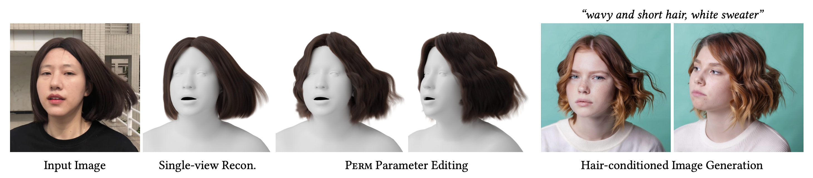

<p align="center">

  <h2 align="center">Perm: A Parametric Representation for Multi-Style 3D Hair Modeling</h2>
  <p align="center">
    <a href="https://cs.yale.edu/homes/che/"><strong>Chengan He<sup>1</sup></strong></a>
    ·
    <a href="https://www.sunxin.name/"><strong>Xin Sun<sup>2</sup></strong></a>
    ·
    <a href="https://zhixinshu.github.io/"><strong>Zhixin Shu<sup>2</sup></strong></a>
    ·
    <a href="https://luanfujun.com/"><strong>Fujun Luan<sup>2</sup></strong></a>
    ·
    <a href="https://storage.googleapis.com/pirk.io/index.html"><strong>Sören Pirk<sup>3</sup></strong></a>
    ·
    <a href="https://cemse.kaust.edu.sa/people/person/jorge-alejandro-amador-herrera"><strong>Jorge Alejandro Amador Herrera<sup>4</sup></strong></a>
    ·
    <a href="http://dmichels.de/"><strong>Dominik L. Michels<sup>4</sup></strong></a>
    ·
    <a href="https://tuanfeng.github.io/"><strong>Tuanfeng Y. Wang<sup>2</sup></strong></a>
    ·
    <a href="https://mengzephyr.com/"><strong>Meng Zhang<sup>5</sup></strong></a>
    ·
    <a href="https://graphics.cs.yale.edu/people/holly-rushmeier"><strong>Holly Rushmeier<sup>1</sup></strong></a>
    ·
    <a href="https://zhouyisjtu.github.io/"><strong>Yi Zhou<sup>2</sup></strong></a>
    <br>
    <br>
        <a href="https://arxiv.org/abs/2407.19451"></a>
        <a href='https://cs.yale.edu/homes/che/projects/perm/'></a>
        <a href='https://zhouyisjtu.github.io/project_hair/hair20k.html'></a>
    <br>
    <b><sup>1</sup> Yale University &nbsp; | &nbsp; <sup>2</sup> Adobe Research &nbsp; | &nbsp; <sup>3</sup> CAU &nbsp; | &nbsp; <sup>4</sup> KAUST &nbsp; | &nbsp; <sup>5</sup> Nanjing University of Science and Technology </b>
  </p>
  
  <table align="center">
    <tr>
    <td>
      
    </td>
    </tr>
  </table>

## TODO

- [x] Release cleaned codebase.
- [x] Release pre-trained checkpoints.
- [x] Release fitted Perm parameters for the original 343 hairstyles in USC-HairSalon.
- [x] Release our training set Hair20k.
- [ ] Release processed data used for perm training.
- [ ] Release checkpoints trained on more curly data (v2).
- [ ] Release a reimplementation of our single-view reconstruction pipeline with a public license.

## Getting started

### Installation

Before installing perm, make sure you have CUDA Toolkit 11.3 (or later) installed as noted in [EG3D/StyleGAN3](https://github.com/NVlabs/eg3d/tree/main#requirements), which would be required to compile customized CUDA ops.
CUDA Toolkit 11.3 has been tested on my machine with Ubuntu 22.04, which also requires `gcc <= 10` (I use `gcc=10.5.0`). 
You can use the following commands with Miniconda3 to create and activate your Python environment:

```bash
conda env create -f environment.yml
conda activate perm
pip install -r requirements.txt --no-cache-dir
```

### Pre-trained models

Pre-trained networks can be downloaded and extracted from this [OneDrive link](https://yaleedu-my.sharepoint.com/:u:/g/personal/chengan_he_yale_edu/ESQ2YM2wd39Fg2PNrUQRV_cBg61LQWPFp7xhuq3knOkNtw?e=33h7pF), which are stored as `*.pkl` files following the format of EG3D.

You can use pre-trained networks in your own Python code as follows:
```python
from hair.hair_models import Perm

device = torch.device('cuda')
# main hair model
hair_model = Perm(model_path=model_path, head_mesh=head_mesh, scalp_bounds=scalp_bounds).eval().requires_grad_(False).to(device)
# pre-defined root set
roots, _ = hair_model.hair_roots.load_txt(roots)
roots = roots.to(device)
# output dictionary that contains:
# 1. "image": hair geometry texture, NCHW.
# 2. "strands": sampled and decoded strands.
# 3. "guide_strands": decoded guide strands.
# 4. "theta" and "beta": input or randomly sampled parameters.
out = hair_model(roots=roots.unsqueeze(0), trunc=truncation_psi, trunc_cutoff=truncation_cutoff, random_seed=seed)
```
The above code will use `torch_utils` and `dnnlib` to load the downloaded pickle files, which does not require source code for the networks themselves — their class definitions are loaded from the pickle via `torch_utils.persistence`.

Please refer to [`gen_samples.py`](src/gen_samples.py) for complete code example.

### Generating hairstyles

To generate 3D hairstyles using our pre-trained model, run:
```bash
python src/gen_samples.py --outdir=out --model={model_folder} --roots=data/roots/rootPositions_10k.txt --head_mesh=data/head.obj --seeds=0-99 --trunc=0.8
```
Here `model_folder` should be replaced with the folder containing all `*.pkl` checkpoints. The hairstyles shown in Fig. 5 of our supplemental are generated using seeds `0,14,20,71,78,79,87,88,89,92`.

### Hair parameterization

To fit perm parameters to a given 3D hairstyle, run:
```bash
python src/projector.py --model={model_folder} --target={target_data} --num-steps-warmup=1000 --num-steps=9000 --outdir=fitting --head_mesh=data/head.obj --save-video=false
```
Here `target_data` refers to the processed hair geomerty texture stored in `*.npz` format, which will be mentioned below.

We fitted perm parameters to all 343 USC-HairSalon hairstyles, which can be downloaded from this [OneDrive link](https://yaleedu-my.sharepoint.com/:u:/g/personal/chengan_he_yale_edu/ESmIHlb9IN5NlyRsQnl94mQBmiHEI7gR1tgpFPsEMJomqQ?e=GcrDRi). To convert these parameters back to 3D hairstyles, run:
```bash
python src/gen_from_parameters.py --model={model_folder} --params={npz_param_file} --outdir=fitting/usc-hair --head_mesh data/head.obj
```

### Hairstyle interpolation

To interpolate between two given hairstyles, run:
```bash
python src/style_mixing.py --model={model_folder} --hair1={hair1_data} --hair2={hair2_data} --steps=5 --outdir=lerp --head_mesh=data/head.obj --interp_mode={full, theta, beta}
```
Here `hair1_data` and `hair2_data` correspond to the two processed hair geomerty textures, `steps` controls the number of interpolation steps, and `interp_mode` supports different granularities such as theta only, beta only, and joint interpolation. 

## Datasets

### Hair20k

We name our training set Hair20k, an augmented version of [USC-HairSalon](https://huliwenkidkid.github.io/liwenhu.github.io/) that contains ~20k hairstyles. More information can be found on this [dataset page](https://zhouyisjtu.github.io/project_hair/hair20k.html). Please download the data aligned with the AVATAR NEO head to `data/usc-hair` and `data/usc-hair-mix`, or create symbolic links under the `data` directory.

### Data processing

To generate necessary data for perm, run the following script:
```bash
bash scripts/process-usc-hair.sh
```
This script will:
1. horizontally flip each hairstyle to further augment the dataset.
2. solve PCA blend shapes for hair strands.
3. fit geomerty textures with PCA coefficients (nearest interpolation produces better results than bilinear when sampled with different hair roots).
4. compress geomerty textures from `256x256` to `32x32` to obtain textures for **guide strands**.

The PCA fitting process has a certain demand on the memory size. In our experiments, 64GB memory should be enough for all USC-HairSalon strands. The fitted geometry textures are stored as `*.npz` files, which include:
- `texture`: the texture itself, CHW.
- `mask`: baldness map of the hairstyle, 1HW.
- `roots`: 2D roots of strands in the uv space.

The processed data from the above pipeline (PCA blend shapes, fitted geometry textures) can be downloaded from **[TODO]**.

## Training

**StyleGAN2:** To train a StyleGAN2 backbone for our guide textures, run:
```bash
bash scripts/train-rawtex.sh
```

**U-Net:** To train a U-Net as our superresolution module, run:
```bash
bash scripts/train-superres.sh
```

**VAE:** To train a VAE backbone for our residual textures, run:
```bash
bash scripts/train-restex.sh
```

## Evaluation

We report the mean position error (pos. err.) and mean curvature error (cur. err.) as the measurement of our hair reconstruction quality. The usage of these two metrics can be found in `src/eval_blend_shapes.py`.

## Rendering

Most of the figures in our paper are rendered using [Hair Tool](https://joseconseco.github.io/HairTool_3_Documentation/) in Blender. We highly recommend checking out this excellent addon!

Note that some generated hairstyles may contain extremely short strands, which are caused by the expressive limitations of PCA (those zero-length strands after PCA projection and decoding). To filter out these strands and produce a clean rendering, run:
```bash
python src/preprocess.py --process_fn=filter --indir={input_data_folder} --outdir={output_data_folder} --length=2
```
Here `input_data_folder` are the folder of hairstyles stored in `*.data` format.

These filtered results can be converted to `*.obj` files for Blender rendering using:
```bash
python src/preprocess.py --process_fn=convert --indir={input_data_folder} --outdir={output_obj_folder}
```

## Acknowledgements

- Our head mesh is created by [AVATAR NEO](https://avatarneo.com/) and can be downloaded from [this link](https://www.avatarneo.com/PinscreenGenericHeadModel.obj). Please rename it to `head.obj` and put it under `data` if you use our provided scripts directly.
- Our code structure is based on [EG3D](https://github.com/NVlabs/eg3d).
- Our naming convention and model formulation are heavily influenced by [SMPL](https://smpl.is.tue.mpg.de/).

**Huge thanks to our vendors and these outstanding open-source projects for their support!**

## Citation

If you found this code or paper useful, please consider citing:
```bibtex
@article{he2024perm,
    title={Perm: A Parametric Representation for Multi-Style 3D Hair Modeling},
    author={He, Chengan and Sun, Xin and Shu, Zhixin and Luan, Fujun and Pirk, S\"{o}ren and Herrera, Jorge Alejandro Amador and Michels, Dominik L and Wang, Tuanfeng Y and Zhang, Meng and Rushmeier, Holly and Zhou, Yi},
    journal={arXiv preprint arXiv:2407.19451},
    year={2024}
}
```

## Contact

If you run into any problems or have questions, please create an issue or contact `chengan.he@yale.edu`. To obtain models trained on Adobe's internal data and our single-view reconstruction pipeline, please reach out to `yizho@adobe.com` for an **individual release license**.